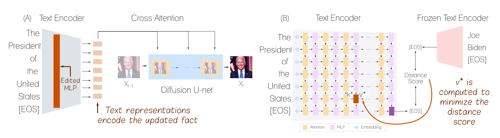

# ReFACT: Updating Text-to-Image Models by Editing the Text Encoder


##  Abstract
Text-to-image models are trained on extensive amounts of data, leading them to implicitly encode factual knowledge within their parameters. While some facts are useful, others may be incorrect or become outdated (e.g., the current President of the United States). We introduce **ReFACT**, a novel approach for editing factual knowledge in text-to-image generative models. ReFACT updates the weights of a specific layer in the text encoder, only modifying a tiny portion of the model’s parameters, and leaving the rest of the model unaffected. We empirically evaluate ReFACT on an existing benchmark, alongside RoAD, a newly curated dataset. ReFACT achieves superior performance in terms of generalization to related concepts while preserving unrelated concepts. Furthermore, ReFACT maintains image generation quality, making it a valuable tool for updating and correcting factual information in text-to-image models.



## Installation
```
conda create -n refact python=3.9
conda activate refact
cd ReFACT
pip install -r requirement.txt
```

## Run ReFACT on edit requests from file:

Best configuration on RoAD
```
python clip_edit.py --file <file_path> --model CompVis/stable-diffusion-v1-4 --dataset RoAD --data_split validation --algorithm contrastive_text --v_similarity_metric l2 --edit_layer 7 --v_lr 0.05 --v_max_grad_steps 100 --v_prob_threshold 0.99 --v_weight_decay 0.01 --use_negative_images --num_negative_images 20
```

Best configuration on TIME dataset
```
python clip_edit.py --file <file_path> --model CompVis/stable-diffusion-v1-4 --dataset RoAD --data_split validation --algorithm contrastive_text --v_similarity_metric l2 --edit_layer 9 --v_lr 0.05 --v_max_grad_steps 100 --v_prob_threshold 0.99 --v_weight_decay 0.01 --use_negative_images --num_negative_images 20
```
